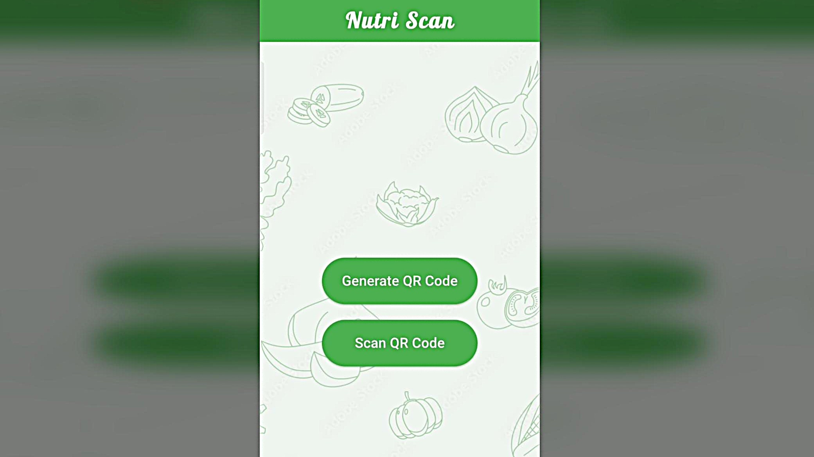
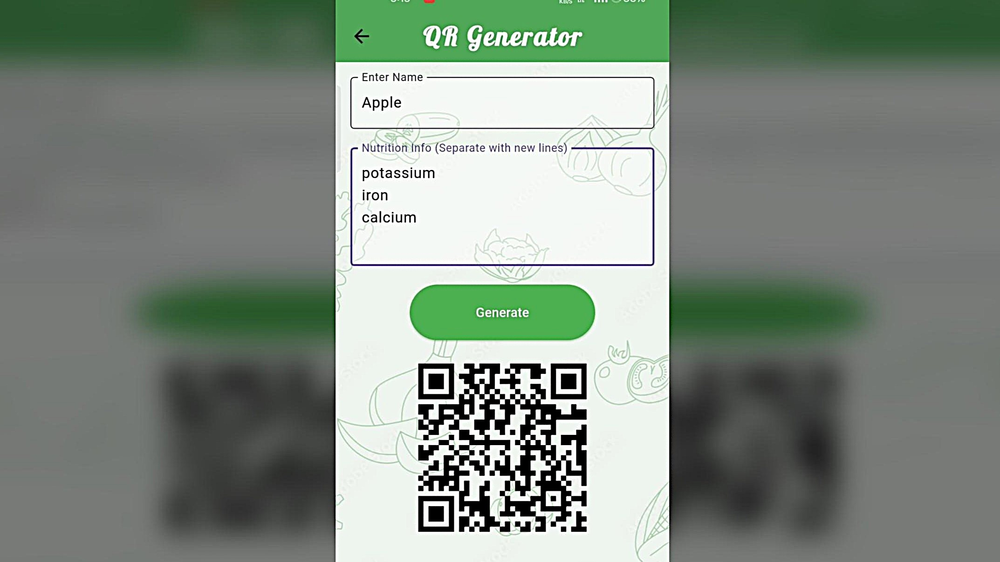
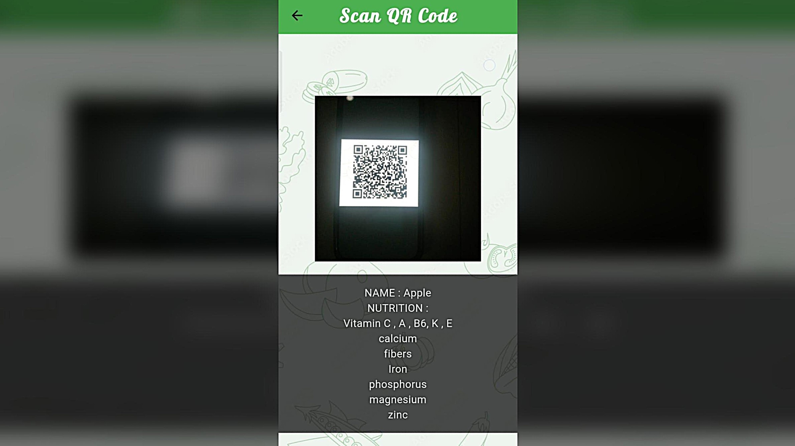

# Nutri Scan

Nutri Scan is a Flutter-based mobile application that allows users to generate and scan QR codes containing nutritional information for food items.

## Features
- Generate QR codes with nutrition data
- Scan QR codes to view food information
- JSON-based data encoding
- Clean Flutter UI

## Technologies Used
- Flutter
- Dart
- qr_flutter
- mobile_scanner

## Screenshots

